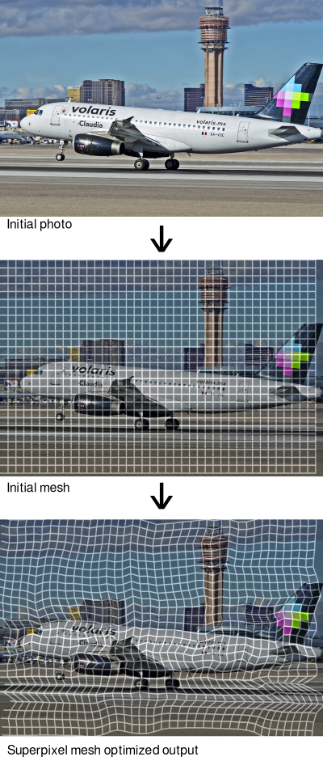

# Superpixel Mesh

A tiny library to generate a mesh of superpixels from some image

<p align="center">
  
</p>


This repo can be tested in your browser. See [here](https://manlio.mx/projects/superpixel-mesh), where additionally I have an explanation of what this thing can do.

## Motivation

There are a pretty solid algos to generate superpixels, yet, I needed one that:

- Generates a polygon mesh.
- It is an optimal approximation.

## Building

You need to have installed:

- Compiler with C++17 features available.
- [ceres-solver](http://ceres-solver.org/) (tested using version 2.0.0)

To build demo app, you also need
- [OpenCV](http://opencv.org/) (tested using version 4.5.0, needed modules: core, highui, imgproc, imgcodec)

To enable unit tests:
- [GTest](https://github.com/google/googletest)

## Running the sample app

```
demo_opencv /path/to/image.ext
```

## Future work

- Multilevel mesh partioning, to allow faces with high error to be optimized separately.
